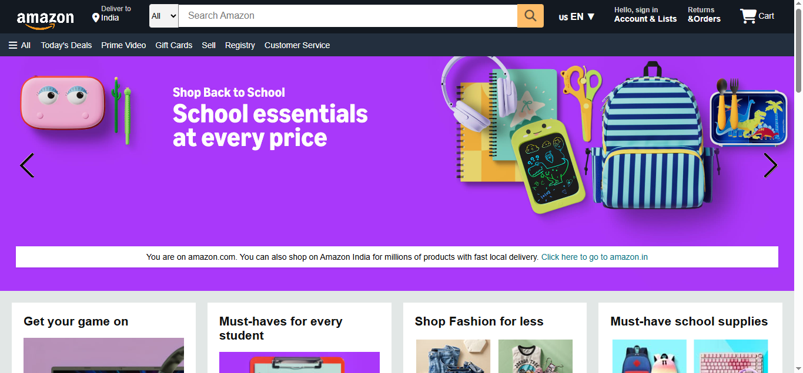

# 🛒 Amazon Clone

> A responsive Amazon homepage clone built using **HTML**, **CSS**, and **JavaScript**.

## ✨ Features

- 🏠 Amazon-inspired homepage
- 📱 Fully responsive layout
- 🔍 Search bar & navigation
- 🛍️ Product showcase cards
- 🎨 Modern UI with hover effects
- ⚡ Interactive elements using JavaScript

## 🛠️ Tech Stack

- HTML5
- CSS3
- JavaScript (ES6)

## 📸 Preview

## 🚀 Live Demo

🔗https://amazonclone-cqorgbi6r-chiranjeev-2707s-projects.vercel.app/

⭐ **If you like this project, don't forget to star the repository!**
